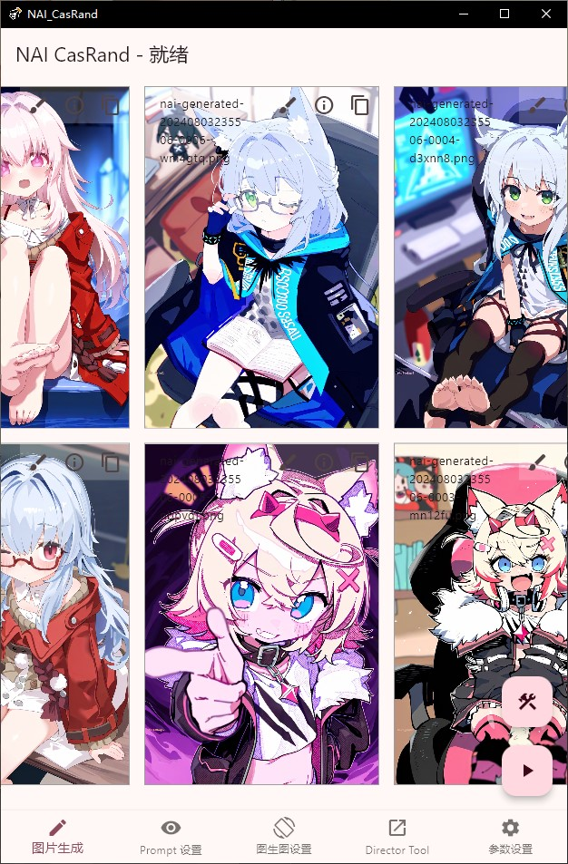
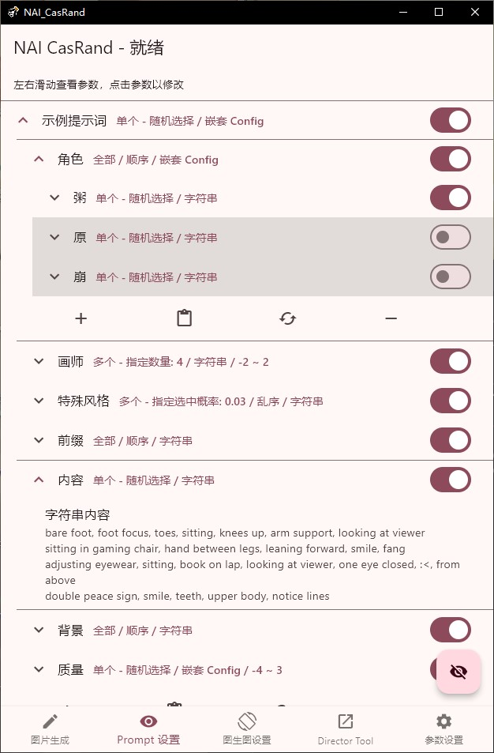
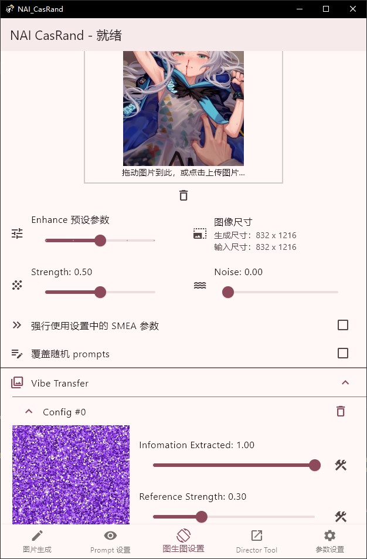
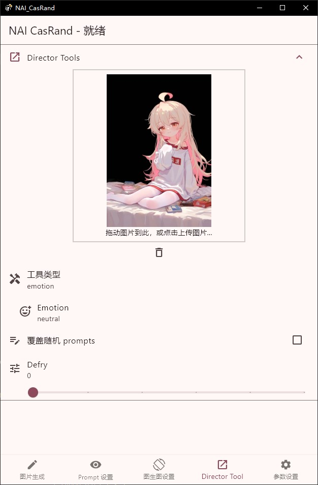
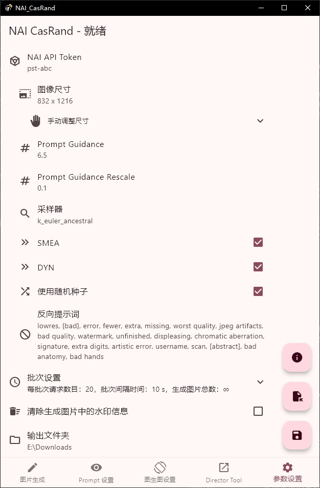

# NAI CasRand

<p align="center">
  
</p>

<p align="center">
  <b>NAI Cascaded Random Generator</b><br/>
  一个基于 Flutter 的 NovelAI 图像批量生成工具，支持按级联规则随机组合提示词（prompt），并调用官方 API 批量生图。
</p>

<p align="center">
  
  
  
  
  
</p>

---

## 目录

- [简介](#简介)
- [核心特性](#核心特性)
- [界面展示](#界面展示)
- [环境配置](#环境配置)
- [快速上手](#快速上手)
- [业务流程](#业务流程)
- [前端页面结构](#前端页面结构)
- [项目架构](#项目架构)
- [Prompts 级联配置](#prompts-级联配置)
- [Sentry 反代劫持](#sentry-反代劫持)
- [支持平台](#支持平台)
- [从源码构建](#从源码构建)
- [缓存清理指南](#缓存清理指南)
- [项目目录](#项目目录)
- [CI/CD](#cicd)
- [常见问题](#常见问题)
- [许可证](#许可证)

---

## 简介

**NAI CasRand** 是一个按指定模式生成随机提示词（prompt）、并将其与生成参数一起发送到 NovelAI API 以获取图像的工具。它解决了以下几类典型需求：

- 想从大量喜欢的画师 / 风格中，通过组合和统计找到最合适的搭配；
- 想批量得到某个或某组角色在不同场景、动作下的图像；
- 想要持续、无人值守地 roll 图，通过概率和级联结构让结果既丰富又可控。

通过**级联（Cascaded）**的配置体系，你可以精细地描述"什么时候选哪些词、以什么方式拼接、以多大的概率出现、以及要不要加权"，然后让 CasRand 自动地循环生成。

## 核心特性

- 🎲 **级联随机提示词**：支持 `单个（随机/顺序）`、`多个（指定数量/指定概率）`、`全部` 五种选取模式，任意嵌套。
- 🖌️ **权重括号随机化**：为每个被选中的词条随机添加 `{}` 括号，自动调整权重。
- 🔗 **前后缀插入语法**：使用 `|||` 分隔符，可以把一条词条拆成前后两半分别拼接到 prompt 的首尾。
- 🖼️ **完整的生成参数**：支持 txt2img、img2img、Vibe Transfer（V4 vibe bundle），以及 Director Tools 全套功能。
- 🧩 **配置导入 / 导出**：所有设置可以一键保存为 JSON，在 PC Web 端编辑好后导入到手机上批量生图。
- 🌐 **跨平台**：同一套代码支持 Windows / Android / Web / macOS / Linux。
- 🌏 **多语言**：内置简体中文与英文（`easy_localization`）。
- 🎨 **自适应主题**：跟随系统亮暗，并支持手动切换（`adaptive_theme`）。
- 🔐 **本地加密存储**：使用 `hive` + `encrypt` 在本地安全地保存 API Token。
- 🔄 **Sentry 反代劫持**：接入 nai-sentry 本地反向代理，多人共享账号时自动夺回 Token，生图端无感切换。
- ⏱️ **可配 API 超时**：默认 60 秒超时，可在设置页调整（0 = 无限等待），避免请求永久挂起。
- 🛡️ **429 限流保护**：频率受限时直接提示，不再误报 ZIP 解压错误。
- 🔍 **配置导入校验**：导入 JSON 时自动检查格式完整性，损坏或不兼容的配置会提示错误而非崩溃。
- 🧹 **架构规范化**：统一 GetIt 依赖注入、页面状态缓存（IndexedStack）、完整 i18n 覆盖。

## 界面展示

| 图像生成                | 提示词设置              |
| ----------------------- | ----------------------- |
|  |  |

| I2I / Vibe Transfer 设置 | Director Tools          | 生成参数和用户选项      |
| ------------------------ | ----------------------- | ----------------------- |
|   |  |  |

## 快速上手

### 0. 环境配置

#### 必需环境

| 工具 | 版本要求 | 说明 |
| --- | --- | --- |
| Flutter SDK | ≥ 3.3.4（stable） | 包含 Dart SDK ≥ 3.3 |
| Git | 任意 | 克隆仓库 |

#### 各平台额外依赖

| 平台 | 额外依赖 |
| --- | --- |
| Windows | Visual Studio 2022 + "Desktop development with C++" 工作负载 |
| Android | Android Studio + Android SDK（compileSdk 35, minSdk 23）；真机或模拟器 |
| Web | Chrome 浏览器（`flutter run -d chrome`） |
| macOS | Xcode ≥ 14 + CocoaPods |
| Linux | `clang`, `cmake`, `ninja-build`, `pkg-config`, `libgtk-3-dev`（Ubuntu/Debian） |

#### 首次运行

```bash
git clone <repo-url>
cd NAI-Generator-Flutter
flutter pub get          # 拉取依赖
flutter run -d windows   # 或 chrome / android 等
```

Windows 用户也可以直接双击 `run_windows.bat`（脚本会自动定位项目目录）。

> `run_windows.bat` 和 `build_windows.bat` 中的 `FLUTTER_ROOT` 默认指向 `D:\Software\flutter`，如果你的 Flutter 安装路径不同，需要修改脚本第 4 行。

#### 编译时密钥（可选）

CI/CD 和正式构建使用 `--dart-define-from-file=secrets.json` 注入以下编译时常量：

| 键 | 用途 |
| --- | --- |
| `ASSET_KEY_BASE64` | AES 密钥，用于解密捐赠二维码等加密资源 |
| `ASSET_IV_BASE64` | AES IV |
| `GITHUB_REPO_LINK` | 关于页面中的 GitHub 仓库链接 |

本地开发不提供 `secrets.json` 也能正常运行，只是加密资源无法解密、关于页面链接为空。

### 1. 填写 Token

进入 **参数设置** 页面，填入 NovelAI 的 API Token。

> Token 获取方式：`novelai.net → 设置 → Account → Get Persistent API Token`

如果没有填写或填写错误，生图时会得到 `Unauthorized` 错误。

如果你使用 nai-sentry 反代劫持（多人共享账号场景），可以跳过手动填写 Token，直接在设置页开启「反代劫持」开关即可。详见下方 [Sentry 反代劫持](#sentry-反代劫持) 章节。

### 2. 生成图片

在 **图像生成** 页面，点击 **开始** 按钮即可按当前设置循环生成；点击 **停止** 结束。

- Web 端：图片以浏览器下载的方式保存。
- Android 端：图片自动保存到相册。
- 桌面端：保存到指定目录。

在页面设置菜单中可调整每轮生成数量、展示方式等。

### 3. 保存 / 读取配置

在 **参数设置** 页面：

- **保存**：将当前所有设置（含 prompts 配置）导出为 JSON 文件。
- **导入**：读取此前保存的 JSON，恢复全部设置。

导出的 JSON 是跨平台的，可以在 PC Web 端精心编辑完，再同步到手机上批量生图。

> 导入时会自动校验 JSON 格式完整性（检查 `prompt_config` 等必要字段），如果文件损坏或格式不兼容会显示错误提示，不会导致崩溃。

## 业务流程

### 核心生图流程

```
用户点击「开始」
  │
  ▼
GenerationPageViewmodel.startBatch()
  │  设置 CommandStatus.isBatchActive = true
  │
  ▼  ┌─────────────── 批次循环 ───────────────┐
  │  │                                         │
  │  ▼                                         │
  │  GeneratePayloadUseCase.call()             │
  │    ├─ PromptConfig.getPrmpts()             │
  │    │    递归遍历 Config 树，按选取策略       │
  │    │    （随机/顺序/概率/数量/全部）         │
  │    │    选取词条，拼接 prompt                │
  │    ├─ CharacterConfig.getPrompt()          │
  │    │    生成角色 prompt + 位置映射           │
  │    ├─ ParamConfig.getPayload()             │
  │    │    组装生成参数（model/steps/sampler…） │
  │    ├─ 附加 Vibe Transfer 配置              │
  │    └─ 返回 PayloadGenerationResult         │
  │         { payload, comment, fileName }     │
  │                                            │
  │  ▼                                         │
  │  ApiService.fetchData()                    │
  │    POST → image.novelai.net (或 sentry 反代)│
  │    Bearer Token 认证                       │
  │    可配超时（默认 60s）                     │
  │                                            │
  │  ▼                                         │
  │  ImageService.processResponse()            │
  │    解压 ZIP → 提取 image_0.png             │
  │                                            │
  │  ▼                                         │
  │  ImageService.embedMetadata() (可选)       │
  │    隐写术嵌入自定义元数据到 PNG alpha 通道   │
  │                                            │
  │  ▼                                         │
  │  FileService.savePictureToFile()           │
  │    Web → 浏览器下载                         │
  │    Android → SaverGallery 保存到相册        │
  │    Windows → 写入指定目录                   │
  │                                            │
  │  ▼                                         │
  │  创建 InfoCardContent → 瀑布流展示          │
  │                                            │
  │  ▼  批次内延迟（innerInterval + jitter）    │
  │  └──────────── 下一张 ────────────────────┘
  │
  ▼  批次间冷却（interval + jitter）
  └──── 下一批次（直到达到总数或用户停止）
```

### 错误处理

| HTTP 状态码 | 处理方式 |
| --- | --- |
| 401 Unauthorized | 停止批次，显示认证失败提示；如果开启了 Bark 推送，发送通知到手机 |
| 429 Too Many Requests | 记录日志，显示限流提示，自动跳过当前请求继续下一张 |
| 超时 | 自动跳过，继续下一张（最多重试 3 次） |

### 配置持久化流程

```
导出：PayloadConfig.toJson() → JSON 字符串 → 文件保存（FileService）
导入：文件读取 → JSON 解析 → schema 校验（检查 prompt_config 键）
      → PayloadConfig.fromJson()（所有字段有默认值兜底）
      → 写入 Hive（ConfigService.saveConfig()）

本地存储：Hive box "savedBox"
  ├─ configIndex: { uuid → { title, timestamp } }  配置索引
  └─ savedConfig-{uuid}: JSON string               单份配置
```

## 前端页面结构

应用共 3 个主页面，通过底部导航栏（窄屏）或侧边导航栏（宽屏 ≥ 640px）切换，使用 `IndexedStack` 缓存页面状态：

### 页面 1：图像生成（GenerationPageView）

- 瀑布流网格展示已生成的图片（`WaterfallFlow`，可调列数）
- 批次进度条（当前批次 / 总数）
- 3 个浮动按钮：
  - 🔧 显示设置（列数、清空列表、覆盖 prompt 开关）
  - ➕ 仅生成 prompt 预览（不调 API）
  - ▶️/⏹ 开始 / 停止批量生成
- 点击图片卡片查看大图、prompt 详情、生成参数
- 支持覆盖 prompt 模式（手动输入 prompt 替代级联生成）

### 页面 2：生成配置（ConfigPageView）

内含 3 个 Tab：

| Tab | 组件 | 功能 |
| --- | --- | --- |
| Prompt Config | `PromptTabView` | 编辑级联 prompt 树 + 角色配置（最多 5 个角色，每个有独立 prompt 和位置） |
| Vibe Transfer | `I2iTabView` | V3 模型：`VibeConfigListView`；V4 模型：`VibeConfigV4ListView`（支持 `.naiv4vibe` 文件和 PNG iTXt 提取） |
| Generation Parameters | `ParametersConfigView` | 模型选择（6 款）、图片尺寸（多尺寸随机）、采样步数、CFG、采样器、噪声调度器、SMEA/DYN、Variety+、种子、负面提示词 |

### 页面 3：参数设置（SettingsPageView）

| 设置区块 | 内容 |
| --- | --- |
| API Token | NovelAI 持久化 Token（sentry 模式下灰显） |
| Sentry 反代劫持 | 开关 + 反代地址 + 连通测试 |
| Batch Settings | 每批数量、批次间隔/抖动、批内间隔/抖动、总生成数、瀑布流上限、API 超时 |
| 元数据 | 擦除开关 + 自定义假元数据嵌入 |
| 输出目录 | 仅桌面端，指定图片保存路径 |
| 文件名前缀 | 支持 `__key__` 变量替换（从 prompt 树中提取） |
| HTTP 代理 | 非 Web 端可配代理 |
| Bark 推送 | 设备 Key + 认证失败通知开关 + 冷却时间 |
| 已保存配置 | 管理多套配置（新建/重命名/删除/切换） |
| 外观 | 主题（亮/暗/跟随系统）、语言（中/英） |
| 导入/导出 | 浮动按钮：导入/导出全部设置为 JSON 文件 |

### 全局功能

- 拖放图片到窗口 → 自动提取 NAI 隐写元数据 → 弹窗选择导入参数（`MetadataDropArea`）
- 顶部应用栏动态状态指示：空闲 / 生成中（旋转图标）/ 冷却中（闪烁文字）
- 响应式布局：窄屏底部导航栏，宽屏侧边 `NavigationRail`

## Prompts 级联配置

NAI CasRand 用一棵 **Config 树** 来描述如何从词条池中随机组合 prompts。每个 `Config` 节点都具有以下属性：

| 属性           | 作用                                                                  | 可选值                                                                          |
| -------------- | --------------------------------------------------------------------- | ------------------------------------------------------------------------------- |
| `选取方式`     | 指示如何从下属内容里选取                                              | `单个-随机`、`单个-顺序`、`多个-指定数量`、`多个-指定概率`、`全部`              |
| `打乱顺序`     | 当选取 `多个-指定概率` 或 `全部` 时，是否打乱选中内容顺序             | `是` / `否`                                                                     |
| `选中数量`     | 当选取 `多个-指定数量` 时，指定选中的数量                             | 整数（≤ 下属长度）                                                              |
| `选中概率`     | 当选取 `多个-指定概率` 时，每条被选中的概率                           | 浮点数（0~1）                                                                   |
| `随机括号数量` | 为每个被选中条目，随机添加 `{}` 括号以调权重                          | 两个整数 `[min, max]`                                                           |
| `下属设置类型` | 下属是一组字符串词条，还是嵌套的子 Config                             | `字符串内容` / `嵌套 Config`                                                    |
| `下属设置内容` | 具体内容                                                              | 若为字符串：每行一个词条；若为嵌套：一个 Config 列表                             |

### 使用技巧

- **顺序遍历的陷阱**：当多个 Config 同时使用 `单个-顺序遍历` 时，由于各自计数器独立，可能出现某些组合永远不会被选中。
- **前后缀语法**：如果词条中包含 `|||`，软件会把该词条按分隔符切成两段，前段拼接到当前 prompt 的开头、后段拼接到末尾。可用于"在一段 prompt 中间插入额外内容"。
- **Prompt 预览**：在生成页面的设置中可以 **只生成 prompt、不生成图片**，用来调试当前配置。

### 默认配置示例

每次启动时会加载一个简单的默认配置作为示范，其顶层 Config `示例提示词` 以 `全部` 模式串起以下子节点：

| 子 Config  | 作用                                                   |
| ---------- | ------------------------------------------------------ |
| `角色`     | 从列表中 **随机选一个** 角色                            |
| `画师`     | **随机选 4 个** 画师，每个额外随机加 0~2 层权重括号     |
| `特殊风格` | 以 **3% 概率** 追加线稿、3D 模型等特殊风格              |
| `前缀`     | 固定拼接的前缀（例如："必须是萝莉"）                    |
| `内容`     | 从若干动作 / 场景中 **随机选一个**                      |
| `背景`     | 固定背景描述                                            |
| `质量`     | 固定的质量标签（"叠 buff"）                             |

## Sentry 反代劫持

当多人共享同一 NovelAI 账号时，Token 会被互相覆写导致生图中断。[nai-sentry](../Dev) 是一个独立的 Python 守护脚本，持续监控 Token 状态，被抢时自动夺回。

开启后，Flutter 客户端的生图请求走本地反代（默认 `localhost:7899`），nai-sentry 自动注入最新 Token，实现无感替换。

### 使用方式

1. 确保 nai-sentry 已安装并运行（`nai-sentry run`）
2. 在 Flutter 设置页展开「反代劫持」区块
3. 勾选「启用反代劫持」
4. （可选）点击「测试连通」确认服务可达

启用后，API Key 和 HTTP 代理字段会灰显——它们的值不会被修改，只是本次不使用（由 sentry 接管）。关闭开关后恢复原有行为。

### 数据流

```
Flutter → POST localhost:7899/ai/generate-image (Bearer sentry-placeholder)
  → nai-sentry 替换为真实 Token，通过 VPN 代理转发
    → POST image.novelai.net/ai/generate-image (Bearer pst-xxx...)
```

详细技术文档见 `docs/SENTRY_PROXY_INTEGRATION.md`。

## 支持平台

| 平台     | 状态   | 说明                                             |
| -------- | ------ | ------------------------------------------------ |
| Windows  | ✅     | 提供 `run_windows.bat` / `build_windows.bat`     |
| Android  | ✅     | 自动保存图片到相册，需授予存储权限               |
| Web      | ✅     | 浏览器下载图片                                   |
| macOS    | ✅     | 需自行配置签名                                   |
| Linux    | ✅     | 需安装 GTK 依赖                                  |
| iOS      | ⚠️     | 代码可编译，未做上架适配                         |

## 从源码构建

### 前置条件

- Flutter SDK ≥ **3.3.4**（稳定通道），CI 使用 **3.29.3**
- Dart SDK ≥ **3.3**
- 目标平台对应的构建工具链（见上方 [环境配置](#0-环境配置)）

### 步骤

```bash
# 1. 克隆仓库
git clone <repo-url>
cd NAI-Generator-Flutter

# 2. 拉取依赖
flutter pub get

# 3. 运行（开发模式）
flutter run                 # 自动检测默认设备
flutter run -d chrome       # Web
flutter run -d windows      # Windows

# 4. 打包发布（不含加密资源密钥）
flutter build windows       # Windows: build/windows/x64/runner/Release/
flutter build apk --release # Android: build/app/outputs/flutter-apk/
flutter build web           # Web:     build/web/

# 5. 打包发布（含加密资源密钥，需要 secrets.json）
flutter build apk --dart-define-from-file=secrets.json
```

Windows 用户也可以直接双击根目录下的 `run_windows.bat` 或 `build_windows.bat`。

## 缓存清理指南

Flutter 在构建过程中会生成大量缓存和中间文件。当你遇到以下问题时，通常需要清理缓存：

- 移动了项目目录后构建报错（符号链接指向旧路径）
- 插件符号链接冲突（`PathExistsException: Cannot create link, errno = 183`）
- 修改了代码但运行后没有变化
- 升级 Flutter SDK 后构建失败
- 切换分支后出现莫名其妙的编译错误

### 快速清理（推荐）

```bash
# 一键清理：删除所有构建缓存并重新拉取依赖
flutter clean && flutter pub get
```

这条命令会自动清除 `build/`、`.dart_tool/`、各平台的 `ephemeral/` 目录。

### 深度清理（解决顽固问题）

如果 `flutter clean` 不够，手动删除以下目录：

```bash
# Windows PowerShell
Remove-Item -Recurse -Force build
Remove-Item -Recurse -Force .dart_tool
Remove-Item -Recurse -Force windows\flutter\ephemeral
Remove-Item -Recurse -Force linux\flutter\ephemeral

# 然后重新拉取依赖
flutter pub get
```

```bash
# macOS / Linux (bash)
rm -rf build .dart_tool
rm -rf windows/flutter/ephemeral
rm -rf linux/flutter/ephemeral
rm -rf macos/Flutter/ephemeral
rm -rf ios/Flutter/ephemeral
flutter pub get
```

### 使用 bat 脚本清理（Windows）

```bash
# run_windows.bat 支持 clean 参数，会自动清理后再运行
./run_windows.bat clean
```

### 各缓存目录详解

| 目录 / 文件 | 大小 | 说明 | 清理方式 |
| --- | --- | --- | --- |
| `build/` | 数百 MB | 编译产物（CMake 输出、.obj、.exe 等） | `flutter clean` 自动清除 |
| `.dart_tool/` | ~50 KB | Dart 包解析配置、插件注册代码 | `flutter clean` 自动清除 |
| `windows/flutter/ephemeral/` | ~300 MB | Windows 引擎二进制（flutter_windows.dll）+ 插件符号链接 | `flutter clean` 自动清除；**符号链接冲突时必须手动删除** |
| `linux/flutter/ephemeral/` | ~1 MB | Linux 插件符号链接 | `flutter clean` 自动清除 |
| `macos/Flutter/ephemeral/` | ~1 KB | macOS 生成的 Xcode 配置 | `flutter clean` 自动清除 |
| `ios/Flutter/ephemeral/` | ~1 KB | iOS 生成的 LLDB 辅助脚本 | `flutter clean` 自动清除 |
| `windows/flutter/generated_*.cc/.h/.cmake` | ~10 KB | 自动生成的插件注册代码 | `flutter pub get` 重新生成 |
| `linux/flutter/generated_*.cc/.h/.cmake` | ~10 KB | 同上（Linux 版） | `flutter pub get` 重新生成 |
| `.flutter-plugins-dependencies` | ~16 KB | 插件依赖映射 JSON | `flutter pub get` 重新生成 |
| `android/.gradle/` | 数十 MB | Gradle 构建缓存 | 手动删除：`rm -rf android/.gradle` |
| `android/local.properties` | ~60 B | 本地 SDK 路径（机器相关） | 手动删除后 `flutter pub get` 重新生成 |
| `pubspec.lock` | ~31 KB | 依赖锁定文件 | **不要删除**，这是版本锁定文件，应该提交到 Git |

### 符号链接冲突（errno = 183）专项修复

这是 Windows 上最常见的缓存问题，通常发生在项目目录移动后：

```
PathExistsException: Cannot create link, path =
'...\windows\flutter\ephemeral\.plugin_symlinks\device_info_plus'
(OS Error: 当文件已存在时，无法创建该文件。, errno = 183)
```

原因：`ephemeral/.plugin_symlinks/` 下的符号链接仍指向旧的 pub cache 路径，Flutter 尝试创建同名新链接时冲突。

修复：

```powershell
# 删除 ephemeral 目录（包含所有旧符号链接）
Remove-Item -Recurse -Force windows\flutter\ephemeral

# 重新清理并拉取
flutter clean
flutter pub get

# 再次运行
flutter run -d windows
```

或者直接用 bat 脚本：

```bash
./run_windows.bat clean
```

### 完整核弹级清理（万不得已）

如果以上方法都不行，执行完整重置：

```powershell
# 1. 删除所有生成目录
Remove-Item -Recurse -Force build -ErrorAction SilentlyContinue
Remove-Item -Recurse -Force .dart_tool -ErrorAction SilentlyContinue
Remove-Item -Recurse -Force windows\flutter\ephemeral -ErrorAction SilentlyContinue
Remove-Item -Recurse -Force linux\flutter\ephemeral -ErrorAction SilentlyContinue
Remove-Item -Recurse -Force android\.gradle -ErrorAction SilentlyContinue

# 2. 删除生成的插件注册文件
Remove-Item -Force windows\flutter\generated_plugin_registrant.cc -ErrorAction SilentlyContinue
Remove-Item -Force windows\flutter\generated_plugin_registrant.h -ErrorAction SilentlyContinue
Remove-Item -Force windows\flutter\generated_plugins.cmake -ErrorAction SilentlyContinue

# 3. 删除插件依赖映射
Remove-Item -Force .flutter-plugins-dependencies -ErrorAction SilentlyContinue

# 4. 重新拉取依赖并构建
flutter pub get
flutter run -d windows
```

## 项目架构

### 整体架构：MVVM + Service Locator

```
┌─────────────────────────────────────────────────┐
│                    UI Layer                      │
│  NavigationView (IndexedStack)                   │
│  ├─ GenerationPageView ← GenerationPageViewmodel │
│  ├─ ConfigPageView                               │
│  │   ├─ PromptTabView ← PromptTabViewmodel       │
│  │   ├─ I2iTabView ← I2iTabViewmodel             │
│  │   └─ ParametersConfigView ← viewmodel         │
│  └─ SettingsPageView ← SettingsPageViewmodel      │
├─────────────────────────────────────────────────┤
│                 Use Case Layer                   │
│  GeneratePayloadUseCase                          │
├─────────────────────────────────────────────────┤
│                  Data Layer                      │
│  Models:   PayloadConfig, PromptConfig,          │
│            ParamConfig, Settings, ...            │
│  Services: ApiService, ConfigService,            │
│            FileService, ImageService,            │
│            BarkService, LogService               │
├─────────────────────────────────────────────────┤
│              Infrastructure                      │
│  GetIt (DI)  │  Hive (存储)  │  HTTP (网络)     │
└─────────────────────────────────────────────────┘
```

### 架构约束

| 规则 | 说明 |
| --- | --- |
| DI 统一 GetIt | 所有服务和共享状态通过 `GetIt.I()` 获取，不混用 Provider |
| ViewModel 无 BuildContext | 构造函数不接收 `BuildContext`，保持 MVVM 分层 |
| builder 无副作用 | `ListenableBuilder.builder` 中不执行网络请求或状态修改 |
| IndexedStack 缓存 | 页面切换不重建，保持用户输入状态 |
| 配置导入校验 | `PayloadConfig.loadJson()` 检查 `prompt_config` 键存在性 |
| fromJson 默认值兜底 | `PromptConfig.fromJson` 所有字段有 `??` 默认值 |
| 全量 i18n | 所有用户可见字符串走 `tr()`，不硬编码 |

### 关键数据模型

| 模型 | 职责 |
| --- | --- |
| `PayloadConfig` | 根配置对象，聚合所有子配置（prompt、参数、设置、vibe、i2i） |
| `PromptConfig` | 递归树结构，描述级联随机 prompt 的选取规则 |
| `ParamConfig` | 生成参数（模型、尺寸、步数、采样器、CFG 等），`getPayload()` 输出 API payload |
| `Settings` | 应用设置（Token、代理、批次参数、主题、语言等） |
| `CharacterConfig` | 角色配置（位置、正/负 prompt），最多 5 个 |
| `VibeConfig` / `VibeConfigV4` | Vibe Transfer 配置（V3 图片引用 / V4 vibe bundle） |
| `I2IConfig` | 图生图配置（底图、强度、噪声） |
| `CommandStatus` | 批次运行状态（活跃/冷却/计数），用 `ValueNotifier` 驱动 UI |

### 服务层

| 服务 | 职责 |
| --- | --- |
| `ApiService` | HTTP POST 调用 NAI API，支持代理和超时 |
| `ConfigService` | Hive 持久化：加载/保存/管理多套配置（UUID 索引） |
| `FileService` | 跨平台文件保存（Web 下载 / Android 相册 / 桌面目录） |
| `ImageService` | ZIP 解压、缩略图生成、隐写术元数据嵌入/提取 |
| `BarkService` | Bark 推送通知（认证失败告警） |
| `LogService` | 日志写入（429 限流、握手异常等） |

### 主要依赖库

| 库 | 用途 |
| --- | --- |
| `get_it` | 服务定位器 / 依赖注入 |
| `hive` | 本地 KV 存储（配置持久化） |
| `encrypt` | AES 加密（Token 存储、资源解密） |
| `easy_localization` | 国际化（en / zh-CN） |
| `adaptive_theme` | 自适应主题（亮/暗/系统） |
| `flutter_command` | 异步命令模式（ViewModel 中的操作封装） |
| `waterfall_flow` | 瀑布流网格布局 |
| `archive` | ZIP 解压（NAI API 返回的图片） |
| `image` | 图片解码/编码/缩放 |
| `super_drag_and_drop` | 拖放支持（图片元数据提取） |
| `file_picker` | 文件选择对话框 |
| `saver_gallery` | Android 相册保存 |
| `path_provider` | 平台安全目录获取 |
| `png_chunks_extract` | PNG chunk 解析（V4 vibe 提取） |

## 项目目录

```
NAI-Generator-Flutter/
├── lib/
│   ├── main.dart                    # 应用入口：GetIt 注册、Hive 初始化、主题/i18n 配置
│   ├── core/
│   │   └── constants/
│   │       ├── defaults.dart        # 默认负面提示词、水印内容、文件名前缀、预设尺寸
│   │       ├── parameters.dart      # 模型列表(6款)、采样器、噪声调度器、元数据键
│   │       ├── settings.dart        # 主题模式映射
│   │       └── image_formats.dart   # 拖放支持的图片格式
│   ├── data/
│   │   ├── models/
│   │   │   ├── payload_config.dart  # 根配置（聚合所有子配置）
│   │   │   ├── prompt_config.dart   # 级联 prompt 树（递归结构）
│   │   │   ├── param_config.dart    # 生成参数 → API payload
│   │   │   ├── settings.dart        # 应用设置
│   │   │   ├── character_config.dart # 角色配置（位置+prompt）
│   │   │   ├── i2i_config.dart      # 图生图配置
│   │   │   ├── vibe_config.dart     # Vibe Transfer V3
│   │   │   ├── vibe_config_v4.dart  # Vibe Transfer V4（.naiv4vibe / PNG iTXt）
│   │   │   ├── director_tool_config.dart # Director Tools（去背景/线稿/上色/表情…）
│   │   │   ├── command_status.dart  # 批次运行状态
│   │   │   ├── api_request.dart     # 请求/响应 DTO
│   │   │   ├── info_card_content.dart # 瀑布流卡片数据
│   │   │   └── generation_size.dart # 图片尺寸
│   │   ├── services/
│   │   │   ├── api_service.dart     # HTTP POST + 代理 + 超时
│   │   │   ├── config_service.dart  # Hive 配置管理（UUID 索引）
│   │   │   ├── file_service.dart    # 跨平台文件保存 + AES 资源解密
│   │   │   ├── image_service.dart   # ZIP 解压 + 缩略图 + 隐写术
│   │   │   ├── bark_service.dart    # Bark 推送通知
│   │   │   └── log_service.dart     # 日志记录
│   │   └── use_cases/
│   │       └── generate_payload_use_case.dart  # 核心业务：prompt 生成 + payload 组装
│   └── ui/
│       ├── core/                    # 共享 UI 组件
│       │   ├── utils/flushbar.dart  # SnackBar 通知（info/error/warning）
│       │   └── widgets/             # EditableListTile, SliderListTile 等
│       ├── navigation/              # 导航框架
│       │   ├── widgets/
│       │   │   ├── navigation_view.dart    # IndexedStack + 响应式导航
│       │   │   ├── navigation_appbar.dart  # 动态状态应用栏
│       │   │   ├── metadata_drop_area.dart # 拖放元数据提取
│       │   │   └── debug_settings_view.dart
│       │   └── view_models/
│       ├── generation_page/         # 页面1：生图
│       │   ├── widgets/
│       │   │   ├── generation_page_view.dart  # 瀑布流 + FAB 控制
│       │   │   └── info_card.dart             # 图片卡片
│       │   └── view_models/
│       │       └── generation_page_viewmodel.dart  # 批次循环 + API 调用
│       ├── config_page/             # 页面2：配置（3 Tab）
│       ├── prompt_tab/              #   Tab1: Prompt 配置
│       ├── prompt_config/           #     Prompt 树节点编辑
│       ├── character_config/        #     角色配置
│       ├── i2i_tab/                 #   Tab2: Vibe Transfer
│       ├── vibe_config/             #     V3 Vibe
│       ├── vibe_config_v4/          #     V4 Vibe
│       ├── parameters_config/       #   Tab3: 生成参数
│       ├── settings_page/           # 页面3：设置
│       │   ├── widgets/
│       │   │   ├── settings_page_view.dart          # 设置主页
│       │   │   └── config_selection_page_view.dart   # 配置管理页
│       │   └── view_models/
│       └── saved_config_list/       # 已保存配置列表
├── assets/
│   ├── appicon.png                  # 应用图标
│   ├── json/example.json            # 默认配置示例
│   ├── l10n/en.json                 # 英文翻译（206 keys）
│   ├── l10n/zh-CN.json              # 中文翻译
│   └── qrcode1.jpg, qrcode2.jpg    # AES 加密的捐赠二维码
├── android/                         # Android 壳工程（compileSdk 35, minSdk 23）
├── windows/                         # Windows 壳工程（默认窗口 640×960）
├── web/ ios/ macos/ linux/          # 其他平台壳工程
├── .github/workflows/               # CI/CD（见下方）
├── docs/
│   ├── CHANGES.md                   # 改动记录
│   ├── PROJECT_OVERVIEW.md          # 项目说明
│   └── SENTRY_PROXY_INTEGRATION.md  # Sentry 反代技术文档
├── pubspec.yaml                     # 依赖与资源清单
├── run_windows.bat                  # Windows 一键运行
├── build_windows.bat                # Windows 一键打包
└── README.md
```

## CI/CD

项目在 `.github/workflows/` 下配置了 3 条 GitHub Actions 流水线：

| 流水线 | 触发条件 | Runner | 产物 |
| --- | --- | --- | --- |
| `android.yml` | push to `main` / 手动 | `ubuntu-latest` | `app-release.apk` |
| `windows.yml` | push to `main` / 手动 | `windows-latest` | `windows-x64-release.zip` |
| `web.yml` | push to `main` / 手动 | `ubuntu-latest` | `build/web/`（自动部署到 `deploy` 分支） |

所有流水线统一使用 Flutter **3.29.3** stable，通过 `--dart-define-from-file=secrets.json` 注入编译时密钥。

### Android 构建流程

1. 解码 `SECRETS_JSON_CONTENT`（base64）→ `secrets.json`
2. 解码 keystore（`SECRETS_KEYSTORE_BASE64`）→ `upload-keystore.jks`
3. 从 secrets 生成 `key.properties`
4. `flutter build apk --dart-define-from-file=secrets.json`
5. 上传 `app-release.apk` 为 artifact

### Web 构建流程

1. 构建 `flutter build web --release --dart-define-from-file=secrets.json`
2. 上传 `build/web` 为 artifact
3. 切换到 `deploy` 分支，清空后放入构建产物，push（自动部署到托管平台）

## 常见问题

**Q: 提示 `Unauthorized` / 401 怎么办？**
A: 检查 **参数设置** 里的 API Token 是否填写正确，并确认网络能访问 `api.novelai.net`。如果使用 sentry 反代，确认 nai-sentry 服务正在运行，可点击「测试连通」按钮验证。

**Q: 提示「请求频率受限 (429)」怎么办？**
A: NovelAI API 有频率限制。适当增大批次间等待时间（`batch_interval`）和批次内等待时间（`batch_inner_interval`），或减少并发请求数。

**Q: 生图请求一直卡住不返回？**
A: 在设置页 Batch settings 中可配置 API 超时时间（默认 60 秒）。设为 0 表示无限等待。超时后会自动跳过当前请求继续下一张。

**Q: Android 端不保存图片？**
A: 请确认已经授予 App 的存储 / 相册权限（安装后首次保存时会请求）。

**Q: Web 端图片保存到哪里？**
A: Web 模式会触发浏览器下载，文件保存在浏览器的默认下载目录。

**Q: Token 是明文保存的吗？**
A: 不是，Token 通过 `encrypt` 包加密后落到本地 `hive` 存储。

**Q: Sentry 反代启用后原来的 API Key 会被删掉吗？**
A: 不会。开关只控制本次请求走哪条路径，原有的 API Key 和代理设置值不会被修改，关闭开关后立即恢复使用。

**Q: 为什么顺序遍历有时候跳过了一些组合？**
A: 见上文 *"顺序遍历的陷阱"*。多个同级的 `单个-顺序` Config 会各自独立计数，组合上会出现周期错位。建议把需要完整遍历的轴合并到同一个 Config 中。

**Q: 导入配置 JSON 时提示格式错误？**
A: 导入时会校验 JSON 中是否包含 `prompt_config` 等必要字段。如果是旧版本导出的配置或手动编辑过的 JSON，请确认结构完整。缺失字段的配置项会自动使用默认值填充，但完全损坏的文件会被拒绝。

**Q: `run_windows.bat` 运行后没有反映代码修改？**
A: 检查脚本中的 `FLUTTER_ROOT` 是否指向你实际安装的 Flutter SDK 路径。`PROJECT_DIR` 已改为自动定位脚本所在目录（`%~dp0`），不再需要手动修改。如果仍有缓存问题，运行 `run_windows.bat clean` 清除构建缓存后重试。

**Q: V4 Vibe Transfer 怎么用？**
A: 在「生成配置」→「Vibe Transfer」Tab 中，选择 V4 模型后会自动切换到 V4 界面。支持两种导入方式：直接拖入 PNG 图片（从 iTXt chunk 提取 vibe 编码）或导入 `.naiv4vibe` JSON 文件（包含多档位编码）。

**Q: 角色配置的位置是什么意思？**
A: NAI V4 模型支持在画面中指定角色位置。每个角色可以设置一个或多个候选位置（网格坐标 A-E × 0-5），生成时随机选取一个。位置信息会编码到 `v4_prompt.char_captions` 中发送给 API。

**Q: `__key__` 变量替换是什么？**
A: 在 prompt 词条或文件名前缀中使用 `__xxx__` 格式，会自动替换为已保存配置中名为 `xxx` 的 PromptConfig 生成的内容。这样可以在多处复用同一套词条池。

## 许可证

本项目基于 [MIT License](LICENSE) 开源。请在合法合规的前提下使用 NovelAI API，勿用于违反当地法律或 NovelAI 服务条款的用途。
